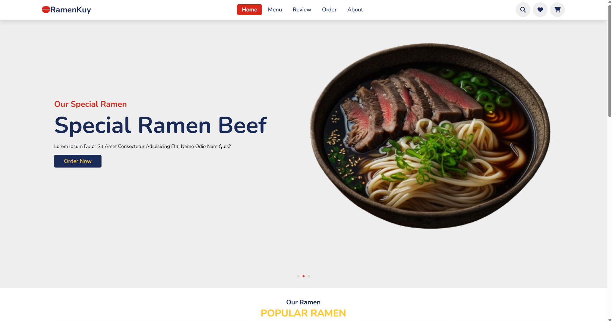

# RamenKu Web

RamenKu is a frontend website for ordering ramen, designed to let users easily choose their favorite menu items. This website features an interactive swiper on the main content section and an appealing menu display.

## Demo
Check out the live website here: [RamenKu Web](https://rifqin-11.github.io/RamenKu-Web/)

## Key Features
- **Interactive Swiper**: The main content section uses a swiper for smooth navigation.
- **Menu Display**: Includes a list of ramen menu items with a responsive and attractive design.

## Technologies Used
- **HTML5**: For page structure.
- **CSS**: For styling and layout.
- **JavaScript**: To add interactivity to the website.

## How to Run the Project
1. Clone this repository to your computer:
   ```bash
   git clone https://github.com/rifqin-11/RamenKu-Web.git
   ```
2. Navigate to the project folder:
   ```bash
   cd RamenKu-Web
   ```
3. Open the `index.html` file in your browser.

## Folder Structure
```
RamenKu-Web/
├── index.html          # Main page
├── css/                # Folder for CSS files
│   └── style.css       # Main styling file
├── js/                 # Folder for JavaScript files
│   └── script.js       # Main interactivity file
└── assets/             # Folder for images and other assets
```

## Screenshot


## Contribution
Contributions are welcome! If you have ideas to improve this project, feel free to submit a pull request or report issues via the [Issues tab](https://github.com/rifqin-11/RamenKu-Web/issues).

## License
This project is licensed under the MIT License. See the `LICENSE` file for more details.

---
Made with ❤️ by [rifqin-11](https://github.com/rifqin-11).
